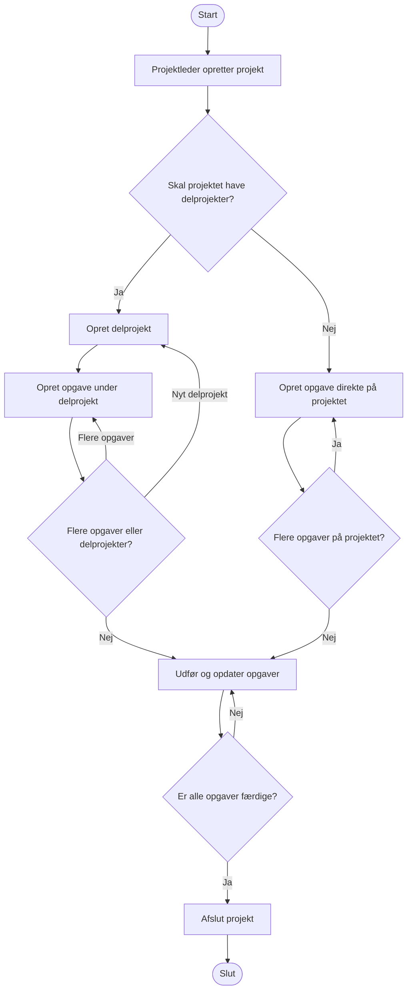

## Aktivitets Diagram

```mermaid
flowchart TD
    Start([Start]) --> OpretProjekt[Projektleder opretter projekt]
    OpretProjekt --> HarDelprojekter{Skal projektet have delprojekter?}

    HarDelprojekter -->|Ja| OpretDelprojekt[Opret delprojekt]
    OpretDelprojekt --> OpretOpgaveUnder[Opret opgave under delprojekt]
    HarDelprojekter -->|Nej| OpretOpgaveDirekte[Opret opgave direkte på projektet]

    OpretOpgaveUnder --> FlereOpgaverUnder{Flere opgaver eller delprojekter?}
    FlereOpgaverUnder -->|Flere opgaver| OpretOpgaveUnder
    FlereOpgaverUnder -->|Nyt delprojekt| OpretDelprojekt
    FlereOpgaverUnder -->|Nej| UdfoerOpgaver[Udfør og opdater opgaver]

    OpretOpgaveDirekte --> FlereOpgaverDirekte{Flere opgaver på projektet?}
    FlereOpgaverDirekte -->|Ja| OpretOpgaveDirekte
    FlereOpgaverDirekte -->|Nej| UdfoerOpgaver

    UdfoerOpgaver --> AlleFaerdige{Er alle opgaver færdige?}
    AlleFaerdige -->|Nej| UdfoerOpgaver
    AlleFaerdige -->|Ja| AfslutProjekt[Afslut projekt]
    AfslutProjekt --> Slut([Slut])
```
