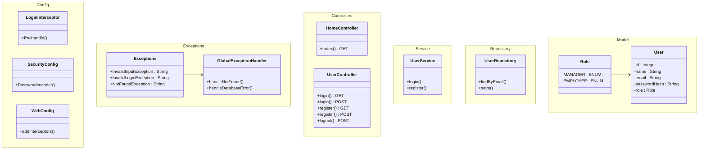

## Klassediagram

```mermaid
classDiagram
    direction TB

    namespace Config {
        class LoginInterceptor {
            +PreHandle()
        }
        class SecurityConfig {
            +Passwordencoder()
        }
        class WebConfig {
            +addInterceptors()
        }
    }

    namespace Exceptions {
        class ExceptionTypes["Exceptions"] {
            +InvalidInputException : String
            +InvalidLoginException : String
            +NotFoundException : String
        }
        class GlobalExceptionHandler {
            +handleNotFound()
            +handleDatabaseError()
        }
    }

    namespace Controllers {
        class HomeController {
            +Index() GET
        }
        class UserController {
            +login() GET
            +login() POST
            +register() GET
            +register() POST
            +logout() POST
        }
    }

    namespace Service {
        class UserService {
            +login()
            +register()
        }
    }

    namespace Repository {
        class UserRepository {
            +findByEmail()
            +save()
        }
    }

    namespace Model {
        class User {
            -id : Integer
            -name : String
            -email : String
            -passwordHash : String
            -role : Role
        }
        class Role {
            -MANAGER : ENUM
            -EMPLOYEE : ENUM
        }
    }

    ExceptionTypes --> GlobalExceptionHandler
    Role --> User
```