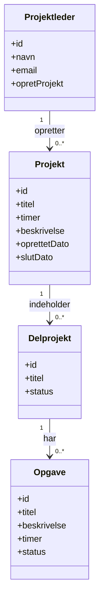

## Domænemodel

```mermaid
classDiagram
    class Projektleder {
        +id
        +navn
        +email
        +opretProjekt
    }

    class Projekt {
        +id
        +titel
        +timer
        +beskrivelse
        +oprettetDato
        +slutDato
    }

    class Delprojekt {
        +id
        +titel
        +status
    }

    class Opgave {
        +id
        +titel
        +beskrivelse
        +timer
        +status
    }

    Projektleder "1" --> "0..*" Projekt : opretter
    Projekt "1" --> "0..*" Delprojekt : indeholder
    Delprojekt "1" --> "0..*" Opgave : har
```