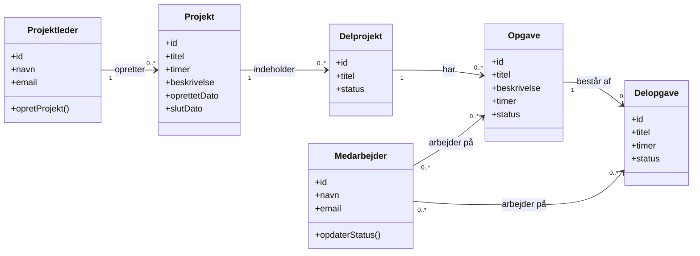

## Domænemodel

```mermaid
classDiagram
direction LR
    class Projektleder {
        +id
        +navn
        +email
        +opretProjekt()
    }

    class Medarbejder {
        +id
        +navn
        +email
        +opdaterStatus()
    }

    class Projekt {
        +id
        +titel
        +timer
        +beskrivelse
        +oprettetDato
        +slutDato
    }

    class Delprojekt {
        +id
        +titel
        +status
    }

    class Opgave {
        +id
        +titel
        +beskrivelse
        +timer
        +status
    }

    class Delopgave {
        +id
        +titel
        +timer
        +status
    }

    Projektleder "1" --> "0..*" Projekt : opretter
    Projekt "1" --> "0..*" Delprojekt : indeholder
    Delprojekt "1" --> "0..*" Opgave : har
    Opgave "1" --> "0..*" Delopgave : består af
    Medarbejder "0..*" --> "0..*" Opgave : arbejder på
    Medarbejder "0..*" --> "0..*" Delopgave : arbejder på
```
